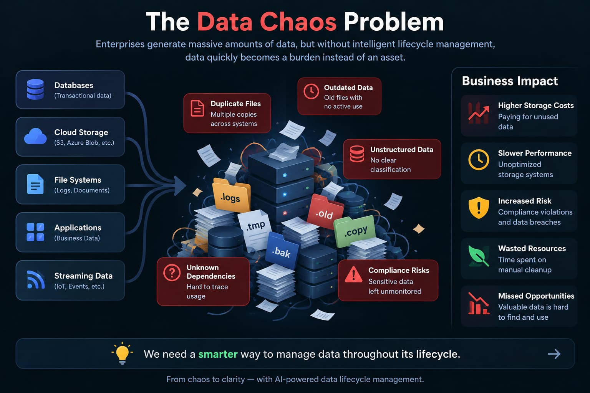
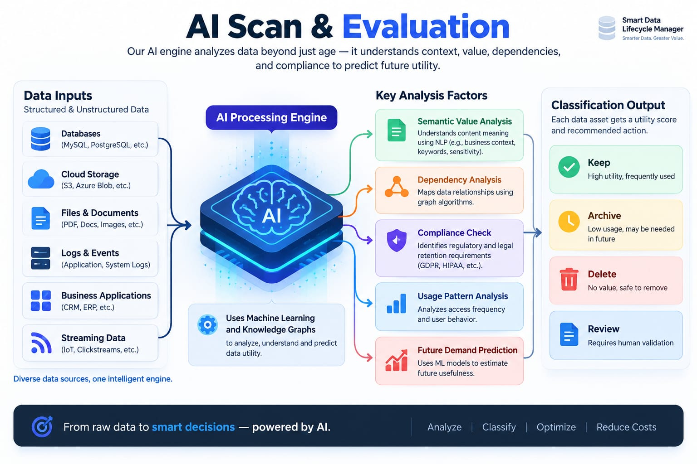
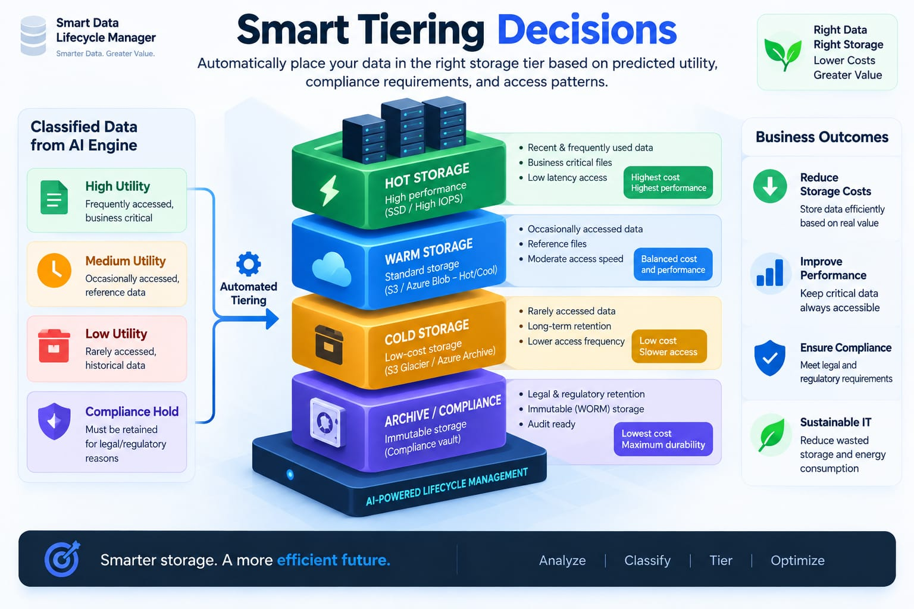
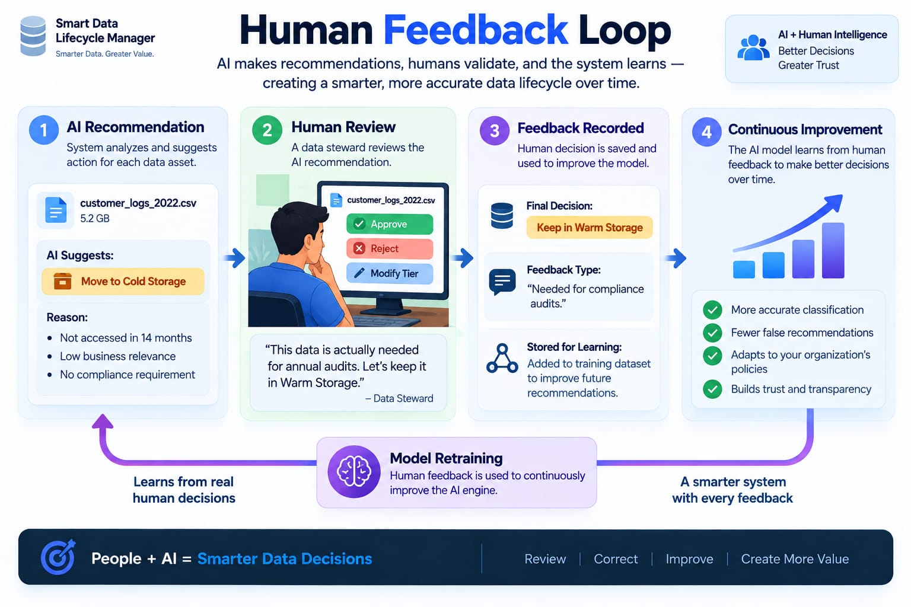

# 💾 AI-Powered Smart Data Lifecycle Manager

An intelligent enterprise storage management engine that evaluates data utility using **semantic value, graph dependencies, and compliance requirements** instead of blunt Time-To-Live (TTL) age policies.

## 🚀 Live Demo

👉 [Launch the Live Application](https://smart-lifecycle-manager-fnqchcjpmsdr3zv5p6fb8p.streamlit.app/)

Try the interactive AI-powered data lifecycle dashboard and explore how data is evaluated and classified based on future demand, compliance, dependency lineage, and storage cost.
---

## 📌 Problem Statement
Traditional cloud lifecycle policies (e.g., AWS S3 Lifecycle, Azure Blob Tiering) rely strictly on access recency ($TTL$). This leads to two critical enterprise issues:
1. **Accidental Data Loss:** Dormant historical artifacts, root blueprints, or legal audits get deleted simply because they haven't been accessed in months.
2. **Storage Sprawl & Bloat:** Disposable duplicate build files and scratch artifacts linger across hot storage, running up cloud bills.

---

## 🧠 AI Valuation Logic
The engine calculates a dynamic **Utility & Retention Index ($URI \in [0, 100]$)**:

$$URI = w_1 P_{\text{future}} + w_2 C_{\text{legal}} + w_3 D_{\text{centrality}} + w_4 U_{\text{affinity}} - w_5 S_{\text{cost}}$$

### Automated Tiering Classification:
* **Active (Hot Storage):** High utility score ($URI \ge 65$) and frequent/recent access patterns.
* **Archived (Warm Storage):** Dormant files with active downstream dependencies ($40 \le URI < 65$).
* **Deep Archive (Cold Storage):** Long-term statutory holds or unique context ($20 \le URI < 40$).
* **Review Queue:** Borderline cases routed for administrative verification before action.
* **Deletion Candidate:** Unreferenced duplicates routed to an immutable 90-day quarantine vault.

---

## 🚀 Quickstart

```bash
# Clone the repository
git clone [https://github.com/](https://github.com/)<your-username>/smart-lifecycle-manager.git
cd smart-lifecycle-manager

# Install dependencies
pip install -r requirements.txt

# Launch interactive dashboard
streamlit run app.py
```
## 🧠 System Concept & Visual Walkthrough

### 1. The Data Chaos Problem



### 2. AI Scan & Evaluation



### 3. Smart Tiering Decisions



### 4. Human Feedback Loop


